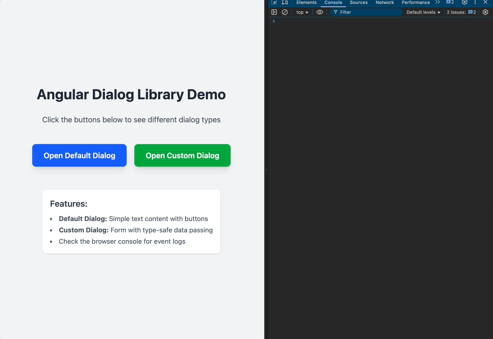

# Angular Dialog Library

A flexible, type-safe, and feature-rich dialog/modal library for Angular 19+ applications built with Angular CDK Overlay.



> **Note:** This project was built in early 2024 to provide dynamic component dialogs for Angular applications. It does not use the new dynamic component feature introduced in Angular 20.
> All dynamic dialog logic here is based on Angular 19 and CDK Overlay best practices.

## Features

✨ **Flexible Content**: Support for plain text, Angular components, or custom content  
🔄 **Bidirectional Data Flow**: Parent-child communication via Angular DI and RxJS  
🎯 **Type-Safe**: Full TypeScript support with generic types for data passing  
🎨 **Customizable Styling**: Built-in Tailwind CSS support with customizable appearance  
🔧 **Advanced Behaviors**: Custom providers, tokens, and overlay strategies  
📦 **Angular CDK Overlay**: Built on top of Angular CDK for robust positioning and behavior

---

## Table of Contents

- [Angular Dialog Library](#angular-dialog-library)
  - [Features](#features)
  - [Table of Contents](#table-of-contents)
  - [Quick Start](#quick-start)
  - [Project Structure](#project-structure)
  - [Installation \& Setup](#installation--setup)
    - [1. Install Dependencies](#1-install-dependencies)
    - [2. Run Demo Application](#2-run-demo-application)
    - [3. Build](#3-build)
    - [4. Test](#4-test)
  - [Usage Guide](#usage-guide)
    - [Basic Usage](#basic-usage)
    - [Opening Default Dialog](#opening-default-dialog)
    - [Opening Component Dialog](#opening-component-dialog)
    - [Dialog Configuration](#dialog-configuration)
      - [`DialogComponentConfig`](#dialogcomponentconfig)
      - [`DefaultDialogConfig`](#defaultdialogconfig)
    - [Passing Data to Dialog](#passing-data-to-dialog)
      - [Method 1: Using `config.data`](#method-1-using-configdata)
      - [Method 2: Custom Injection Token](#method-2-custom-injection-token)
    - [Receiving Data from Dialog](#receiving-data-from-dialog)
    - [Type-Safe Event Handling](#type-safe-event-handling)
  - [API Reference](#api-reference)
    - [`DialogService`](#dialogservice)
    - [`DecorateOverlayRef<T>`](#decorateoverlayreft)
    - [`DialogEvent` Enum](#dialogevent-enum)
    - [`DialogEventPayload<T>`](#dialogeventpayloadt)
  - [Advanced Topics](#advanced-topics)
    - [Custom Injection Tokens](#custom-injection-tokens)
    - [Dependency Injection Explained](#dependency-injection-explained)
      - [Built-in Providers](#built-in-providers)
      - [How It Works](#how-it-works)
    - [Multiple Dialog Instances](#multiple-dialog-instances)
    - [Utilities \& Internal Architecture](#utilities--internal-architecture)
      - [`overlay-ref-builder.util.ts`](#overlay-ref-builderutilts)
      - [`overlay-position-builder.util.ts`](#overlay-position-builderutilts)
      - [`decorate-overlay-ref.ts`](#decorate-overlay-refts)
      - [Example: Custom Overlay](#example-custom-overlay)
  - [Technology Stack](#technology-stack)
  - [Development](#development)
    - [Project Scripts](#project-scripts)
    - [Project Commands](#project-commands)
  - [License](#license)
  - [Contributing](#contributing)
  - [Support](#support)

---

## Quick Start

```typescript
import { Component, inject } from '@angular/core';
import { DialogService } from 'dialog';

@Component({
  selector: 'app-root',
  template: `<button (click)="openDialog()">Open Dialog</button>`,
})
export class AppComponent {
  private dialogService = inject(DialogService);

  openDialog() {
    const ref = this.dialogService.openDefaultDialog({
      injectorID: 'my-dialog',
      title: 'Confirm Action',
      content: 'Are you sure you want to proceed?',
      contentClasses: 'text-gray-700',
      btns: [
        { type: DialogEvent.Cancel, displayName: 'Cancel' },
        { type: DialogEvent.Enter, displayName: 'Confirm' },
      ],
      overlayConfig: DEFAULT_OVERLAY_CONFIG,
    });

    ref.event$.subscribe((event) => {
      console.log('Dialog event:', event);
    });
  }
}
```

---

## Project Structure

This is an NX monorepo with the following structure:

```
angular-dialog-lib/
├── apps/
│   └── skeleton/          # Demo application showcasing the dialog library
├── libs/
│   └── dialog/            # The dialog library
│       ├── src/
│       │   ├── index.ts   # Public API exports
│       │   └── lib/
│       │       ├── services/          # DialogService
│       │       ├── models/            # Types & interfaces
│       │       ├── providers/         # DI tokens
│       │       ├── utils/             # Overlay utilities
│       │       ├── default-configs/   # Default configurations
│       │       └── web-features-dialog/  # Default dialog component
└── md/                    # Additional documentation
```

---

## Installation & Setup

### 1. Install Dependencies

```bash
npm install
```

### 2. Run Demo Application

```bash
npm start
```

The skeleton app will run on `http://localhost:4300` with a demo button to open the dialog.

### 3. Build

```bash
npm run build
```

### 4. Test

```bash
npm test
```

Or test the dialog library specifically:

```bash
npx nx test dialog
```

---

## Usage Guide

### Basic Usage

Import `DialogService` and inject it into your component:

```typescript
import { Component, inject } from '@angular/core';
import { DialogService, DialogEvent } from 'dialog';

@Component({
  selector: 'app-example',
  template: `<button (click)="showDialog()">Open Dialog</button>`,
})
export class ExampleComponent {
  private dialogService = inject(DialogService);

  showDialog() {
    const ref = this.dialogService.openDefaultDialog(config);
    ref.event$.subscribe((event) => {
      if (event.type === DialogEvent.Enter) {
        console.log('User confirmed');
      }
    });
  }
}
```

---

### Opening Default Dialog

Use `openDefaultDialog()` for simple messages, confirmations, or alerts:

```typescript
import { DEFAULT_OVERLAY_CONFIG, DialogEvent } from 'dialog';

const ref = this.dialogService.openDefaultDialog({
  injectorID: 'confirm-dialog',
  title: 'Delete Item',
  content: 'Are you sure you want to delete this item? This action cannot be undone.',
  contentClasses: 'text-sm text-gray-600',
  btns: [
    {
      type: DialogEvent.Cancel,
      displayName: 'Cancel',
      classes: 'bg-gray-200 hover:bg-gray-300',
    },
    {
      type: DialogEvent.Enter,
      displayName: 'Delete',
      classes: 'bg-red-600 hover:bg-red-700 text-white',
    },
  ],
  overlayConfig: DEFAULT_OVERLAY_CONFIG,
  autoClose: true,
});
```

---

### Opening Component Dialog

Use `openComponentDialog<T>()` for custom components with complex interactions:

```typescript
interface FormData {
  name: string;
  email: string;
}

const config: DialogComponentConfig = {
  injectorID: 'user-form-dialog',
  componentRef: () => UserFormDialogComponent,
  overlayConfig: DEFAULT_OVERLAY_CONFIG,
  data: { userId: 123 },
};

const ref = this.dialogService.openComponentDialog<FormData>(config);

ref.event$.subscribe((event) => {
  if (event.type === DialogEvent.Enter) {
    // event.data is type-safe (FormData)
    console.log('Form submitted:', event.data.name, event.data.email);
  }
});
```

---

### Dialog Configuration

#### `DialogComponentConfig`

| Property        | Type                     | Description                                          |
| --------------- | ------------------------ | ---------------------------------------------------- |
| `injectorID`    | `string`                 | Unique identifier for the dialog instance            |
| `componentRef`  | `() => ComponentType<T>` | Factory function returning the component class       |
| `overlayConfig` | `OverlayConfig`          | Angular CDK overlay configuration                    |
| `autoClose?`    | `boolean`                | Auto-close dialog when event is sent (default: true) |
| `data?`         | `D`                      | Data to pass to the dialog component                 |

#### `DefaultDialogConfig`

| Property            | Type                       | Description                               |
| ------------------- | -------------------------- | ----------------------------------------- |
| `injectorID`        | `string`                   | Unique identifier for the dialog instance |
| `title`             | `string`                   | Dialog title                              |
| `content?`          | `string`                   | Plain text content                        |
| `contentComponent?` | `() => ComponentType<any>` | Custom component for content              |
| `contentClasses`    | `ClassType`                | CSS classes for content styling           |
| `btns`              | `DialogBtnSetting[]`       | Button configurations                     |
| `overlayConfig`     | `OverlayConfig`            | Angular CDK overlay configuration         |
| `autoClose?`        | `boolean`                  | Auto-close dialog when button is clicked  |

---

### Passing Data to Dialog

#### Method 1: Using `config.data`

```typescript
// Parent component
const config: DialogComponentConfig = {
  injectorID: 'edit-dialog',
  componentRef: () => EditDialogComponent,
  overlayConfig: DEFAULT_OVERLAY_CONFIG,
  data: { id: 123, name: 'John Doe' },
};

this.dialogService.openComponentDialog(config);
```

```typescript
// Dialog component
import { DIALOG_COMPONENT_PROVIDER } from 'dialog';

@Component({
  selector: 'app-edit-dialog',
  template: `<p>Editing: {{ config.data.name }}</p>`,
})
export class EditDialogComponent {
  constructor(
    @Inject(DIALOG_COMPONENT_PROVIDER)
    public config: DialogComponentConfig
  ) {}
}
```

#### Method 2: Custom Injection Token

```typescript
// Define custom token
export const DIALOG_USER_DATA = new InjectionToken<User>('DIALOG_USER_DATA');

// Parent component
const providers = [{ provide: DIALOG_USER_DATA, useValue: { id: 1, name: 'Alice' } }];

this.dialogService.openComponentDialog(config, providers);
```

```typescript
// Dialog component
@Component({...})
export class UserDialogComponent {
  constructor(@Inject(DIALOG_USER_DATA) public user: User) {}
}
```

---

### Receiving Data from Dialog

Dialog components can send data back to the parent using `DecorateOverlayRef.sendEvent()`:

```typescript
// Dialog component
import { DecorateOverlayRef, DialogEvent } from 'dialog';

interface SubmitData {
  result: string;
  timestamp: number;
}

@Component({...})
export class MyDialogComponent {
  #ref = inject(DecorateOverlayRef<SubmitData>);

  onSubmit() {
    this.#ref.sendEvent({
      type: DialogEvent.Enter,
      data: {
        result: 'success',
        timestamp: Date.now()
      }
    });
  }

  onCancel() {
    this.#ref.sendEvent({
      type: DialogEvent.Cancel,
      data: undefined
    });
  }
}
```

```typescript
// Parent component
const ref = this.dialogService.openComponentDialog<SubmitData>(config);

ref.event$.subscribe((event) => {
  if (event.type === DialogEvent.Enter) {
    console.log('Success:', event.data.result); // type-safe!
  } else if (event.type === DialogEvent.Cancel) {
    console.log('Dialog cancelled');
  }
});
```

---

### Type-Safe Event Handling

The library provides full TypeScript support with generics:

```typescript
interface DialogInput {
  userId: string;
  mode: 'edit' | 'view';
}

interface DialogOutput {
  saved: boolean;
  updatedFields: string[];
}

// Parent component - input and output types are separate
const config: DialogComponentConfig = {
  injectorID: 'user-dialog',
  componentRef: () => UserDialogComponent,
  overlayConfig: DEFAULT_OVERLAY_CONFIG,
  data: { userId: 'abc123', mode: 'edit' } as DialogInput,
};

const ref = this.dialogService.openComponentDialog<DialogOutput>(config);

ref.event$.subscribe((event) => {
  // event.data is automatically typed as DialogOutput
  if (event.type === DialogEvent.Enter) {
    console.log('Saved:', event.data.saved);
    console.log('Updated:', event.data.updatedFields);
  }
});
```

```typescript
// Dialog component
@Component({...})
export class UserDialogComponent {
  #ref = inject(DecorateOverlayRef<DialogOutput>);

  constructor(
    @Inject(DIALOG_COMPONENT_PROVIDER)
    public config: DialogComponentConfig<any, DialogInput>
  ) {
    // Access input data
    console.log(config.data.userId, config.data.mode);
  }

  save() {
    // Send typed output data
    this.#ref.sendEvent({
      type: DialogEvent.Enter,
      data: {
        saved: true,
        updatedFields: ['name', 'email']
      }
    });
  }
}
```

---

## API Reference

### `DialogService`

| Method                                       | Parameters                                                     | Returns                 | Description                                                 |
| -------------------------------------------- | -------------------------------------------------------------- | ----------------------- | ----------------------------------------------------------- |
| `openDefaultDialog(config)`                  | `config: DefaultDialogConfig`                                  | `DecorateOverlayRef`    | Opens a default dialog with simple text content and buttons |
| `openComponentDialog<T>(config, providers?)` | `config: DialogComponentConfig`<br>`providers?: ProviderTypes` | `DecorateOverlayRef<T>` | Opens a custom component dialog with type-safe data return  |

### `DecorateOverlayRef<T>`

| Property/Method      | Type                                       | Description                            |
| -------------------- | ------------------------------------------ | -------------------------------------- |
| `event$`             | `Observable<DialogEventPayload<T>>`        | Observable stream of dialog events     |
| `sendEvent(payload)` | `(payload: DialogEventPayload<T>) => void` | Send an event with optional typed data |
| `close()`            | `() => void`                               | Close the dialog                       |

### `DialogEvent` Enum

| Value           | Description                     |
| --------------- | ------------------------------- |
| `Enter`         | Confirm/submit action           |
| `Cancel`        | Cancel action                   |
| `BackdropClick` | User clicked outside the dialog |

### `DialogEventPayload<T>`

```typescript
interface DialogEventPayload<T = void> {
  type: DialogEvent;
  data?: T;
}
```

---

## Advanced Topics

### Custom Injection Tokens

You can create custom injection tokens to pass any data or services:

```typescript
// Define tokens
export const DIALOG_CONFIG = new InjectionToken<MyConfig>('DIALOG_CONFIG');
export const DIALOG_SERVICE = new InjectionToken<MyService>('DIALOG_SERVICE');

// Provide values
const providers = [
  { provide: DIALOG_CONFIG, useValue: myConfig },
  { provide: DIALOG_SERVICE, useClass: MyService }
];

this.dialogService.openComponentDialog(config, providers);

// Inject in dialog
@Component({...})
export class MyDialog {
  constructor(
    @Inject(DIALOG_CONFIG) public config: MyConfig,
    @Inject(DIALOG_SERVICE) public service: MyService
  ) {}
}
```

---

### Dependency Injection Explained

The dialog library uses Angular's DI system to inject configuration and data into dialog components:

#### Built-in Providers

- **`DIALOG_DEFAULT_PROVIDER`**: Automatically injects `DefaultDialogConfig`
- **`DIALOG_COMPONENT_PROVIDER`**: Automatically injects `DialogComponentConfig`

These providers are automatically set up by `DialogService` when you open a dialog.

#### How It Works

```typescript
// 1. DialogService creates providers internally
const provider = {
  provide: DIALOG_COMPONENT_PROVIDER,
  useValue: config
};

// 2. Creates an overlay with custom injector
const injector = Injector.create({
  parent: this.injector,
  providers: [provider, ...customProviders]
});

// 3. Dialog component injects the config
@Component({...})
export class MyDialog {
  constructor(
    @Inject(DIALOG_COMPONENT_PROVIDER) public config: DialogComponentConfig
  ) {
    // config is available here
  }
}
```

---

### Multiple Dialog Instances

Each call to `openComponentDialog()` creates an independent dialog with its own:

- Overlay instance
- DI context/injector
- Event stream
- Configuration

```typescript
// Open multiple dialogs - they won't interfere with each other
const ref1 = this.dialogService.openComponentDialog(config1);
const ref2 = this.dialogService.openComponentDialog(config2);

// Each dialog has its own event stream
ref1.event$.subscribe((event) => console.log('Dialog 1:', event));
ref2.event$.subscribe((event) => console.log('Dialog 2:', event));
```

Each dialog component will inject its own `DialogComponentConfig` without conflicts, thanks to Angular's DI scoping mechanism.

---

### Utilities & Internal Architecture

The dialog library provides low-level utilities for advanced customization:

#### `overlay-ref-builder.util.ts`

Creates and configures Angular CDK `OverlayRef` instances with custom positioning and behavior.

#### `overlay-position-builder.util.ts`

Provides overlay positioning strategies (centered, custom positions, etc.).

#### `decorate-overlay-ref.ts`

Wraps `OverlayRef` with additional functionality:

- `event$` Observable stream for RxJS-based communication
- `sendEvent()` for type-safe data passing
- `close()` for programmatic dialog closing

#### Example: Custom Overlay

```typescript
import { createRefBuilder, createRefInjector, createPositionBuilder } from 'dialog';

const positionBuilder = createPositionBuilder(overlay);
const refBuilder = createRefBuilder(positionBuilder, overlay);
const refInjector = createRefInjector(injector);

// Use these utilities to build custom dialog behaviors
```

---

## Technology Stack

- **Angular 19** - Core framework with standalone components
- **RxJS 7** - Reactive programming and event streams
- **Angular CDK Overlay** - Robust overlay positioning and management
- **Tailwind CSS 4** - Utility-first CSS framework
- **NX Workspace** - Monorepo tooling and build optimization
- **Jest** - Unit testing framework
- **TypeScript 5** - Type-safe development

---

## Development

### Project Scripts

```bash
# Start demo application (port 4300)
npm start

# Build all projects
npm run build

# Run all tests
npm test

# Test dialog library only
npx nx test dialog

# Lint codebase
npm run lint

# Format code with Prettier
npm run format

# View NX dependency graph
npm run graph
```

### Project Commands

```bash
# Build specific project
npx nx build skeleton
npx nx build dialog

# Test specific project
npx nx test skeleton
npx nx test dialog

# Lint specific project
npx nx lint dialog
```

---

## License

MIT

---

## Contributing

Contributions are welcome! Please feel free to submit a Pull Request.

---

## Support

If you have questions or need help, please open an issue on GitHub.
