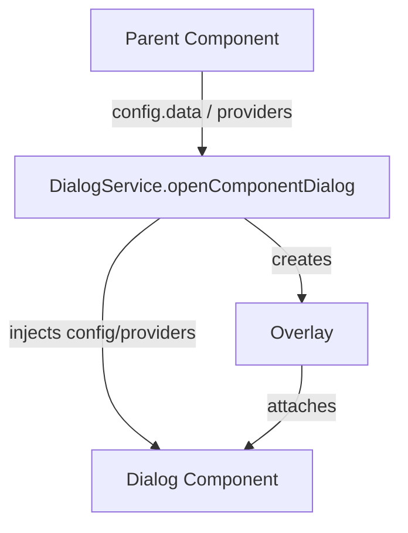
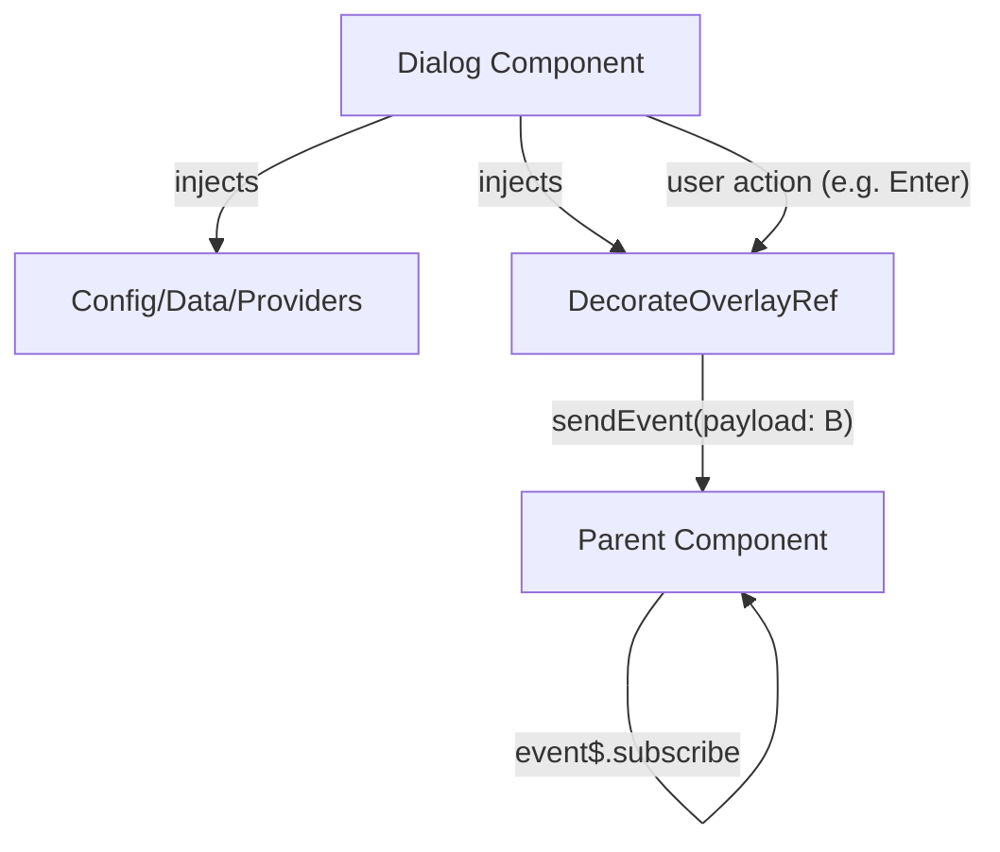

# Dialog Developer Implementation Details

This document is for maintainers or advanced developers, focusing on the implementation, architecture, type safety, DI, utilities, and advanced details of DialogService and related components.

---

## Architecture & Flow

### Key Components

- DialogService: Dialog API and Overlay management
- DialogComponentConfig / DefaultDialogConfig: Dialog configuration
- WebFeaturesDialogComponent: Default dialog UI
- DecorateOverlayRef: Dialog reference and event stream
- Providers/Utils: Dependency injection and overlay utilities

### Flowcharts

#### 1. Parent component creates dialog and injects data



#### 2. DialogComponent receives data and returns type-safe data to parent



---

## Dependency Injection (DI) Overview

Dialog's DI (Dependency Injection) design allows flexible injection of various data, configuration, or services into internal dialog components. This is the core of Angular communication and extensibility.

### Built-in Provider Overview

- **DIALOG_DEFAULT_PROVIDER**: DialogService automatically injects DefaultDialogConfig with this token
- **DIALOG_COMPONENT_PROVIDER**: DialogService automatically injects DialogComponentConfig with this token

### Typical Usage

DialogService automatically injects config via provider into overlay. DialogComponent can use @Inject(TOKEN) to get config.

```typescript
// Inside dialog.provider.ts
export const DIALOG_DEFAULT_PROVIDER = new InjectionToken<DefaultDialogConfig>('DIALOG_DEFAULT_PROVIDER');
export const DIALOG_COMPONENT_PROVIDER = new InjectionToken<DialogComponentConfig>('DIALOG_COMPONENT_PROVIDER');

// DialogService injects like this
const dialogProvider = { provide: DIALOG_DEFAULT_PROVIDER, useValue: config };
const dialogComponentProvider = { provide: DIALOG_COMPONENT_PROVIDER, useValue: config };

// DialogComponent gets config like this
@Component({...})
export class MyDialog {
  constructor(@Inject(DIALOG_COMPONENT_PROVIDER) public config: DialogComponentConfig) {}
}
```

### Custom Data Token

You can define custom InjectionToken to pass any data or service:

```typescript
// Define custom Token
export const MY_TOKEN = new InjectionToken<MyType>('MY_TOKEN');

// Pass in provider
const providers = [{ provide: MY_TOKEN, useValue: { foo: 'bar' } }];
const ref = dialogService.openComponentDialog(config, providers);

// Inject in Dialog
@Component({...})
export class MyDialog {
  constructor(@Inject(MY_TOKEN) public data: any) {}
}
```

### DI Implementation Notes

- These providers are implemented in dialog.provider.ts
- You can pass any data or service in the same way
- DialogService automatically handles config injection; advanced users can customize providers

---

# Utilities

These utilities are core to DialogService, enabling flexible extension and customization. You can use them directly to build your own dialog behaviors.

## overlay-ref-builder.util.ts

- Used to create and configure Angular CDK OverlayRef
- Encapsulates overlay creation, closing, event stream, etc.
- Allows DialogService to quickly generate overlay instances

## overlay-position-builder.util.ts

- Provides overlay position strategies (e.g., center, custom positions)
- You can use it to customize dialog appearance location

## decorate-overlay-ref.ts

- Wraps OverlayRef as DecorateOverlayRef
- Provides event$ stream for RxJS communication inside/outside dialog
- Supports sendEvent, close, and other custom methods

### Internal Usage Example

```typescript
import { createRefBuilder, createRefInjector } from 'dialog';
const refBuilder = createRefBuilder(positionBuilder, overlay);
const refInjector = createRefInjector(injector);
```

- DialogService uses these utilities to create overlays, inject providers, and build event streams
- You can use these tools for advanced dialog customization

---

# Dialog Data Injection & Type-Safe Return

## How to DI Data into DialogComponent

Dialog supports multiple ways to inject data into DialogComponent:

1. config.data field (most common)
2. @Inject(`DIALOG_COMPONENT_PROVIDER`) to get full DialogComponentConfig
3. Custom InjectionToken to pass any data or service

## DI Scope & Multiple Dialog Instances

- Each call to openComponentDialog creates a separate dialog overlay and DI context.
- Each DialogComponent injects DIALOG_COMPONENT_PROVIDER and gets its own config, isolated from other dialog instances.
- Even with multiple dialogs open, each dialog's component gets its own DialogComponentConfig.
- This is Angular DI's scope mechanism; overlay has its own injector, ensuring data isolation.

---

### config.data Example

```typescript
// Parent component
const config: DialogComponentConfig = {
  injectorID: 'my-dialog',
  componentRef: () => MyDialogComponent,
  overlayConfig: DEFAULT_OVERLAY_CONFIG,
  data: { foo: 'bar', id: 123 },
};
const ref = dialogService.openComponentDialog<MyPayload>(config);

// Inside DialogComponent
export class MyDialogComponent {
  constructor(@Inject(DIALOG_COMPONENT_PROVIDER) public config: DialogComponentConfig) {}
  ngOnInit() {
    // Access data
    const foo = this.config.data.foo;
  }
}
```

#### Custom InjectionToken Example

```typescript
// Define Token
export const MY_DIALOG_DATA = new InjectionToken<MyType>('MY_DIALOG_DATA');

// Parent component
const providers = [{ provide: MY_DIALOG_DATA, useValue: { foo: 'bar' } }];
const ref = dialogService.openComponentDialog<MyPayload>(config, providers);

// Inside DialogComponent
export class MyDialogComponent {
  constructor(@Inject(MY_DIALOG_DATA) public data: MyType) {}
}
```

---

## Dialog Returns Data to Parent (Type-Safe)

- DialogComponent injects DecorateOverlayRef<T>, T is the return type
- Use sendEvent({ type, data }) to return data, type is automatically checked
- Parent uses openComponentDialog<T>(), T is the return type, event$ is automatically inferred

#### Separation of Return/Input Types

- config.data: input type (A)
- openComponentDialog<B>(config): return type (B)
- DialogComponent can inject config.data (A) and DecorateOverlayRef<B>

#### Example

```typescript
// Type definitions
interface DialogInput { id: string; foo: string; }
interface DialogOutput { result: string; }

// Parent component
const config: DialogComponentConfig = {
  injectorID: 'my-dialog',
  componentRef: () => MyDialogComponent,
  overlayConfig: DEFAULT_OVERLAY_CONFIG,
  data: { id: 'abc', foo: 'bar' },
};
const ref = dialogService.openComponentDialog<DialogOutput>(config);
ref.event$.subscribe(event => {
  // event.data is automatically DialogOutput
  if (event.type === DialogEvent.Enter) {
    console.log(event.data.result);
  }
});

// Inside DialogComponent
export class MyDialogComponent {
  constructor(@Inject(DIALOG_COMPONENT_PROVIDER) public config: DialogComponentConfig)
  #ref = inject(DecorateOverlayRef<DialogOutput>);
  onConfirm() {
    this.#ref.sendEvent({ type: DialogEvent.Enter, data: { result: 'done' } });
  }
}
```

---

## Summary

- DI and type-safe design ensure dialog data flow isolation and clear types
- Utilities allow advanced users to customize overlay/ref/event stream
- All APIs, types, and event streams have type inference and full DI support
